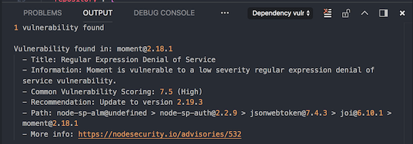
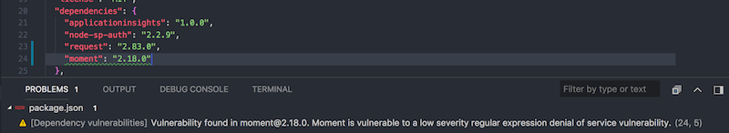
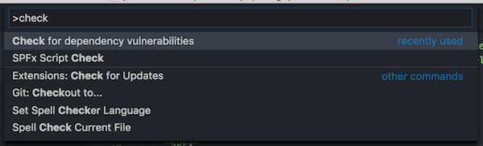

# Dependency Vulnerabilities Checker (VSCode Extension for Node.js projects)

This extension allows you to check for known vulnerabilities in your dependencies against the Node Security Platform [https://nodesecurity.io/](https://nodesecurity.io/).

It allows you to do a **full** check which takes your `package.json`, `npm-shrinkwrap.json`, and `package-lock.json` files and checks it against the NSP API.

Or it can do automated checks while making changes in your `package.json` file.

## How to use the extension

This extension can be used in two ways. 

1. Via the command prompt;
1. Automatic `package.json` checking when the file gets opened, saved, or closed.

If you want to do the complete check, you have to make use of the Visual Studio Code command prompt. start by opening it: 

- Windows `⇧+ctrl+P`
- Mac: `⇧+⌘+P`

Type: `Check for dependency vulnerabilities` and wait for the result to come back.

## Feedback

Feedback is always welcome. Please submit it via creating an issue in the repository: [issue list](https://github.com/estruyf/vscode-dependency-vulnerabilities/issues).